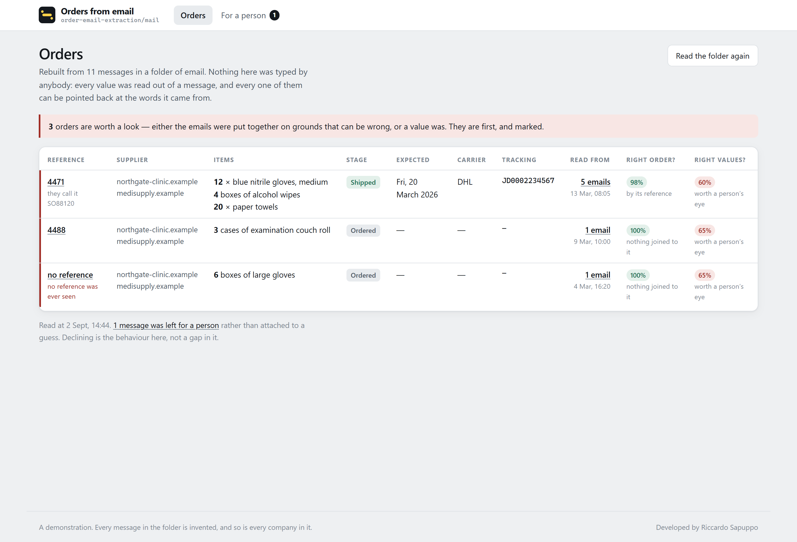
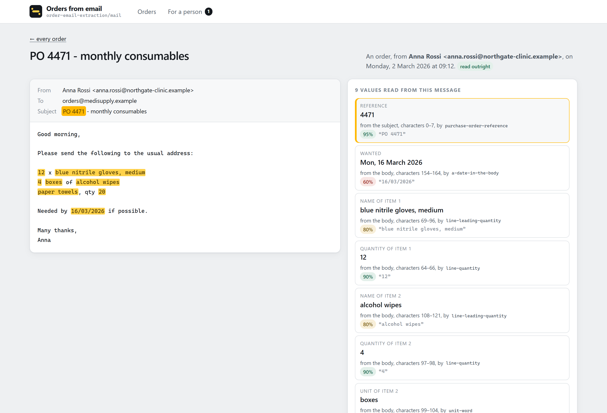
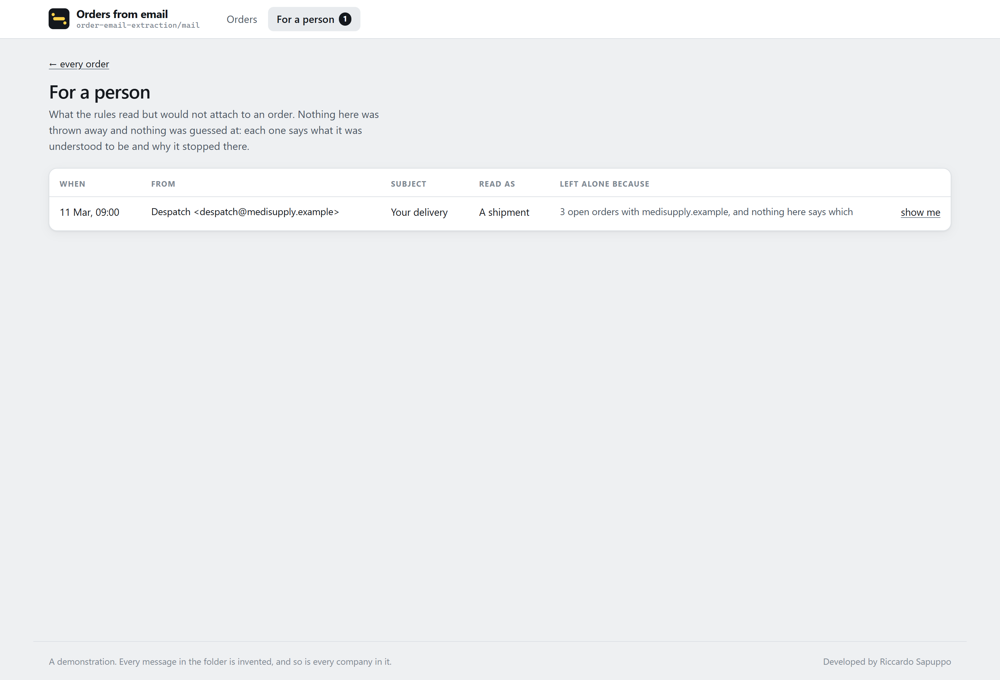
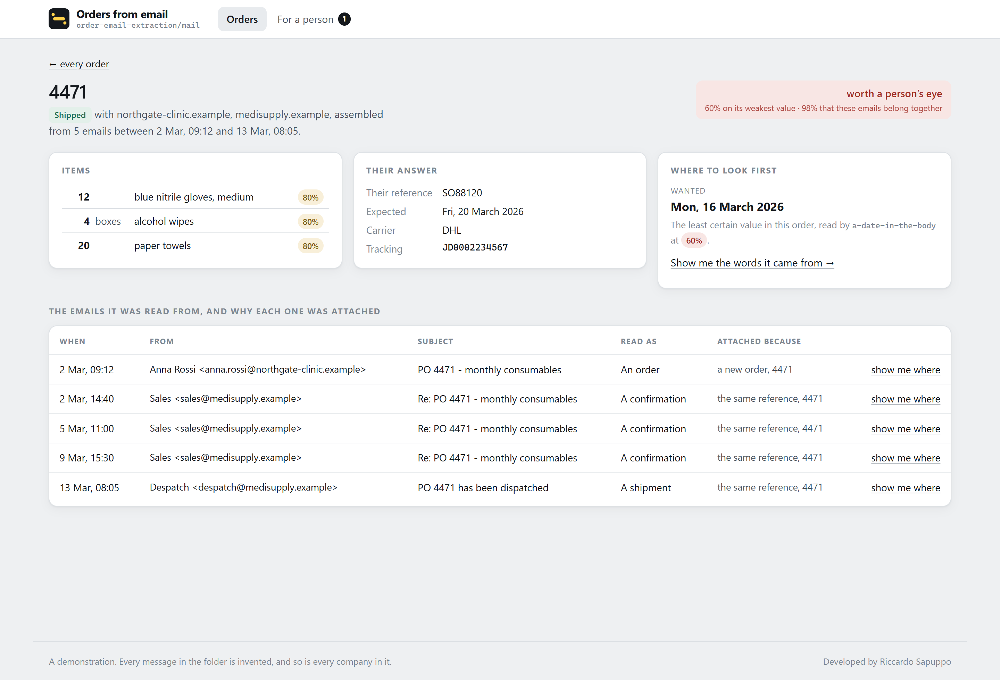
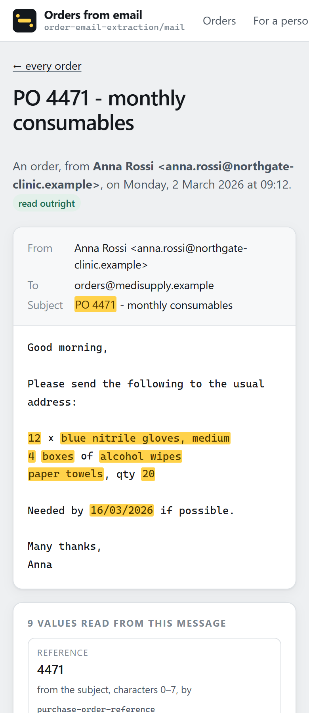

# Orders from email

Reads a folder of `.eml` files and rebuilds the life of an order out of it —
what was asked for, what the supplier answered, where it is now — and can point
at the exact characters every value was read from.

**Nothing here is stored.** There is no database. The email *is* the record, and
the orders are a projection of the mailbox rather than a second copy of the
truth. Restart it and it reads the folder again.



## What it is arguing

Every system of this kind shows you a table of orders. What none of them shows
you is *where a number came from*.

So every field this reads carries three things with it: the offsets of the exact
span of the message it was read from, the name of the rule that read it, and a
confidence used for one decision only — whether it goes through or whether a
person looks. That makes the whole table checkable, one value at a time.



Pick a value and its words light up in the message. Pick a phrase in the message
and the value it produced is selected. The marks are drawn from **offsets**, not
by searching the body for the value again — searching would find the second
`4471` as happily as the first, and a highlight over the wrong occurrence is
worse than none, because it is a wrong claim that looks like evidence.

### Rules, not a model

The reading is done by named rules. That is a trade and it is worth saying which
way it cuts.

It gives up on messages phrased in ways nobody anticipated. In exchange it runs
with no API key, costs nothing per message, gives the same answer twice, can
name the rule and the characters behind every value — and, when it does not
understand, **says so**. A model asked which order an email belongs to will name
one: plausibly, sometimes wrongly, and without ever mentioning that it was
unsure.



## Before you start

- **Node 20.11 or newer.** Checked by `engines` in `package.json` and by CI. The
  exact version CI uses is in [`.github/workflows/ci.yml`](.github/workflows/ci.yml).
- **npm 10 or newer**, which ships with Node 20. This is an npm **workspace**;
  `yarn` and `pnpm` will not read it as written.
- **Nothing else.** No database, no Docker, no API key, no account anywhere. It
  reads a folder and serves it on localhost.
- **About 300 MB** of `node_modules`, almost all of it the Angular build. The
  server and the reading rules have no runtime dependencies but Express.
- **No network** after `npm install`. Nothing is sent anywhere, which is rather
  the point of a tool that reads your mail.
- **To undo it:** delete the folder. Nothing is written outside it.

The browser-driven checks (`check:screen`, `screenshots`) want `playwright-core`
on the path. They are checks, not dependencies, so they are not installed here;
they say so and stop rather than pretending to have passed.

## Running it

```
npm install
npm start          # reads ./mail, serves the API on http://127.0.0.1:3200
npm run web        # the interface on http://localhost:4300
```

Two commands because they are two processes. `npm start` builds every workspace
and runs the server; `npm run web` runs the Angular development server, which
proxies `/api` to it.

Point it at a different folder:

```
npm start -- --folder ../some-other-mailbox --suppliers acme.example,other.example
```

`--suppliers` is which domains are suppliers, so their replies are read as
answers rather than as new orders. In a real deployment that comes from the
supplier list; here it is the demonstration mailbox's one supplier.

**3200 and 4300, not 3000 and 4200.** Those are the ports every project on a
machine uses in turn, and a browser remembers things per origin — service
workers, storage, permissions — so two projects sharing a port share state
neither knows about. An hour went into learning that.

## The eleven messages

`mail/` holds a mailbox built to exercise the cases that are actually hard.
Every company, person and address in it is invented.

| | what it is there for |
|---|---|
| `01-order.eml` | a plain order, three lines, three different phrasings of a quantity |
| `02-confirmation.eml` | the supplier answering, with their own reference and a date |
| `03-shipment.eml` | a carrier and a tracking number |
| `04-order-without-a-reference.eml` | an order with no PO number: held together by the thread and the people on it, which is weaker, and marked |
| `05-partial-answer.eml` | "two of the three" — a confirmation that is not a yes |
| `06-out-of-office.eml` | understood, and attached to nothing |
| `07-marketing.eml` | the same |
| `08-second-order-same-supplier.eml` | the one that broke it: a second order from the same customer, which the first version filed as extra lines on their first |
| `09-shipment-nobody-can-place.eml` | a shipment for an order this mailbox has never seen. Left for a person, which is the behaviour and not a gap in it |
| `10-subject-and-body-disagree.eml` | the subject says one reference and the body another |
| `11-invoice-with-attachment.eml` | multipart, base64, an attachment |

They are stored with CRLF line endings and `.gitattributes` keeps them that way.
That is not a Windows habit: `\r\n` is in the mail format, and a parser tested
only against files git has "helpfully" converted is a parser that breaks on the
first real mailbox.

## One order



The card on the right is the one worth explaining. It names the **least certain
value in the whole order** and links straight to the words it was read from,
because the useful question on this screen is where to start checking.

The table beneath lists every message with **the grounds it was attached on**.
"The same reference, 4471" and "the only open order with this supplier in the
last 90 days" are very different reasons to believe a shipment belongs here, and
a system that joins records without saying which has made a decision nobody can
check. The second of those two is what turned a customer's second order into
extra lines on their first, before the rule was tightened.

### Two questions, not one number

*Right order?* is how sure the system is that these emails belong together.
*Right values?* is the weakest field it read out of them. They are different
questions, they are repaired differently, and collapsing them hides things.

They were one number for a while, and it was wrong twice over. Reporting the
join alone put "100%, read outright" beside the one order in the mailbox with no
reference of its own — the most fragile order on the screen, presented as
certain, because nothing had been joined onto it wrongly, having never been
joined at all. Then taking the minimum of both marked every order as doubtful,
because one date read at 0.6 dragged an otherwise solid order under the line. A
screen on which everything is flagged says nothing.

Each is the **weakest** link and not the average, which would let one certain
value cover three guesses.

## On a phone

<p>
  
</p>

The two columns become one and **the message goes first**. The evidence is the
thing; the list of values is the index to it.

## The API

Everything is derived from the folder on every request, against a snapshot taken
at startup.

```
GET  /api/health           what folder, how many messages, how many orders
GET  /api/orders           every order the mailbox revealed
GET  /api/orders/:key      one order, with every message and why each was attached
GET  /api/messages/:file   a message, WITH THE SPANS every value was read from
GET  /api/for-a-person     what would not be attached to anything
POST /api/reload           take a new snapshot
```

The fourth is the one this project exists for. It returns the subject and the
body along with offsets into them, so an interface can highlight rather than
search.

`POST /api/reload` is the entire write surface, because nothing here owns any
state worth keeping.

## Checking it

```
npm test               # the rules, the parser, the joining, the segmentation
npm run extract        # reads the real .eml files and prints what it found
npm run check:screen   # drives the interface with a browser
npm run check:mark     # the header mark and the tab icon are one drawing
npm run screenshots    # retakes the pictures above
```

`npm test` is 75 tests: 68 over the reading, the parser, the joining and the
segmentation, and 7 over what the interface is actually told about an order.
That second suite was an empty folder for a while, so the package type-checked,
ran nothing and reported success — a check that passes by finding nothing.

**`npm run extract` is the check that is not written behind the same door as the
code.** The suite calls the functions directly and was written alongside them,
which makes it good at saying they still do what they did and blind to a rule
that reads the wrong span of a real message. This reads the actual `.eml` files
and prints every value with the text it came from, so a wrong answer is visible
rather than merely untested. Five defects came out of it that the suite could
not see — among them an item's unit pointing five characters into the product
name, because the offset was measured after the unit had been trimmed off.

**`npm run check:screen` is a third layer, and the layers are not the same
claim.** The suite says the rules work; `extract` says they work on real
messages; only driving the interface says a person can follow a value back to
its words. It also reads the rendered message back and compares it to the API's
body character for character — the marks are drawn by cutting the text at every
span boundary and reassembling it, and a defect there does not throw, it quietly
drops characters out of somebody's email.

It found two things worth having:

- `/messages/01-order.eml` worked from inside the application and answered
  **"Cannot GET"** from the address bar. A path ending in an extension looks to
  a server like a request for a file. The router never asks the server, which is
  what made it invisible — until somebody refreshed the page or opened a link
  they had been sent.
- The card headed **"Doubts"** was listing the grounds each email had been joined
  on. "The same reference, 4471" is a reason to be confident, printed under a
  heading saying the opposite.

## Where things are

```
packages/core      the reading and the joining. No mailbox, no network, no I/O
  facts.ts         Provenance, Field<T>, and the three things an email can be
  extract/rules.ts the named rules, each returning what it read AND where from
  link/join.ts     which order is this about, and what to do when that is unclear
  mail/eml.ts      the .eml parser: folded headers, quoted-printable, multipart
  highlight.ts     cutting text at span boundaries, for the interface
packages/server    Express over a folder. No database
packages/web       the interface
tools/             the checks that are not written behind the same door
mail/              eleven invented messages
```

## What this is not

- It does not scale past a folder somebody can hold. There is no index.
- There is nowhere to record a decision a person makes ("this shipment *does*
  belong to that order"). A real deployment needs a store for **decisions** —
  not for the facts, which stay in the mail.
- It reads plain text. An order sent as a PDF attachment is recognised as having
  one and not read.
- The rules are English-shaped. The phrasings they know are in
  `extract/rules.ts` and are the argument for eventually putting a model behind
  them — as a *proposer* whose output still has to carry a span, not as an
  oracle.

## Licence

MIT. See [LICENSE](LICENSE).

Developed by Riccardo Sapuppo.
